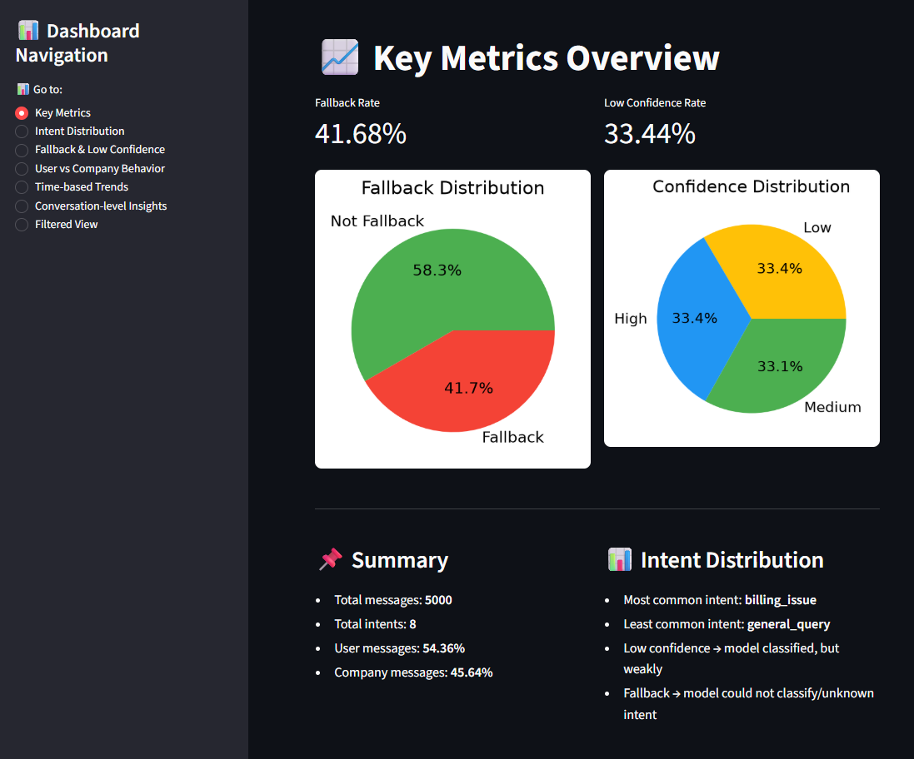

# Conversational AI Analyst — Customer Support Insights Dashboard  
A data-driven conversational analytics project built to simulate how Conversational AI teams analyze customer support interactions, identify taxonomy gaps, evaluate fallback behavior, and generate actionable business insights.

🔗 **Live Dashboard:** https://conversational-ai-analyst.streamlit.app/

---

## 📌 Overview

This project analyzes real customer support conversations from Twitter (TWCS dataset) and simulates an intent classification workflow used by Conversational AI teams.  
It includes:

- Intent distribution analysis  
- Fallback & low-confidence detection  
- Taxonomy gap analysis  
- Overlapping intent evaluation  
- Business insights & recommendations  
- A fully interactive Streamlit dashboard  

The goal is to demonstrate the end-to-end workflow of a **Conversational AI Analyst**, including data cleaning, taxonomy evaluation, conversational insights, and dashboard storytelling.

---
## 🖼️ Dashboard Preview


---
## 🧠 Key Features

### **1. Intent Distribution**
Visualizes how customer messages are categorized across simulated intents.

### **2. Fallback & Low Confidence**
Shows where the model struggles — critical for improving NLU performance.

### **3. Taxonomy Gap Analysis**
Identifies missing intents such as:
- return_request  
- fraud_check  
- account_access_issue  
- technical_issue  
- shipping_delay  

### **4. Overlapping Intent Analysis**
Highlights confusion between:
- billing_issue ↔ refund_request  
- refund_request ↔ return_request  
- complaint ↔ technical_issue  

### **5. Business Insights**
Provides actionable recommendations for:
- improving customer experience  
- refining taxonomy  
- reducing fallback  
- enhancing routing workflows  

---

## 📂 Project Structure

```bash
conversational-ai-analyst/
│
├── app/
│   └── dashboard.py          # Streamlit dashboard
│
├── data/
│   └── twcs_intent_simulated.csv   # Cleaned + simulated intent dataset
│
├── notebooks/
│   ├── 01_cleaning.ipynb
│   ├── 02_exploration.ipynb
│   ├── 03_intent_simulation.ipynb
│   ├── 04_dashboard_metrics.ipynb
│   └── 05_insights.ipynb     # Day 6 taxonomy + business insights
│
├── reports/
│   └── insights.md           # Final Day 6 analysis
│
├── requirements.txt          # Dependencies for Streamlit Cloud
└── README.md                 # Project documentation

## 🚀 Installation & Local Setup
You can run the dashboard locally using the steps below.
```

1. Clone the repository
bash
```
git clone https://github.com/<your-username>/conversational-ai-analyst.git
cd conversational-ai-analyst
```
2. Create a virtual environment (recommended)
bash
```
python3 -m venv venv
source venv/bin/activate   # macOS/Linux
venv\Scripts\activate      # Windows\
```
3. Install dependencies
bash
```
pip install -r requirements.txt\
```
4. Run the Streamlit app
bash
```
streamlit run app/dashboard.py\
```
Your dashboard will open at:
Code
```
http://localhost:8501
```

## 📊 Data Source
This project uses the Twitter Customer Support (TWCS) dataset from Kaggle, which contains real customer support conversations between users and brands.

The dataset was cleaned, normalized, and enriched with simulated intent labels to mimic a real Conversational AI workflow.

## 🧩 Insights & Taxonomy Analysis
The full analysis is available in 📄 reports/insights.md

**It includes:**
- Missing intents
- Overlapping intents
- Recommendations
- Business insights for a customer/operstions support 

This is the core deliverable for Conversational AI Analyst roles.

## 🛠️ Tech Stack
Python 3.10+  
Streamlit — interactive dashboard  
Pandas / NumPy — data processing  
Matplotlib / Seaborn — visualizations  
Jupyter Notebooks — analysis workflow

## 🎯 Purpose of This Project
This project demonstrates the real responsibilities of a Conversational AI Analyst, including:
- Understanding customer intent patterns
- Evaluating fallback & low-confidence behavior
- Identifying taxonomy gaps
- Improving conversational routing
- Communicating insights through dashboards

**It is designed as a portfolio piece for roles in:**
Conversational AI, NLP Analytics, Customer Experience Analytics, 
AI Operations, Support Automation

## 🤝 Contact
If you'd like to collaborate or discuss Conversational AI projects:  

DM me @ Divya Shetty  
**LinkedIn:** https://www.linkedin.com/in/divya-shetty-k/ 

## ⭐ Acknowledgements
Special thanks to the creators of the TWCS dataset and the pen-source tools that made this project possible.
